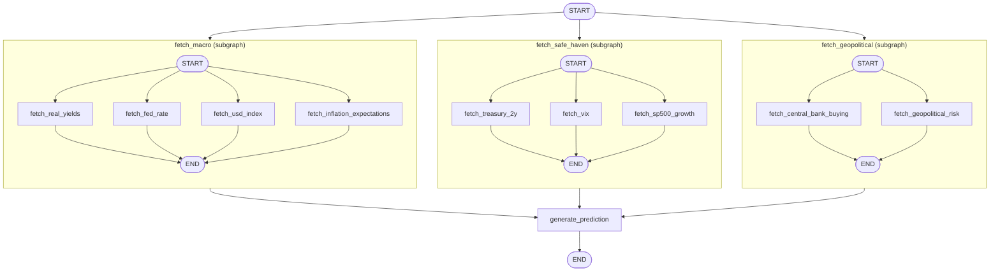

# GoldBot

9-factor AI-powered gold safe-haven analyzer using LangGraph, RAG, and MCP.

**Live app:** https://goldbot-raj.streamlit.app/

## Stack
- Streamlit (frontend)
- LangGraph (agent orchestration)
- RAG pipeline + MCP tools
- SQLite (checkpointing / factor cache)

## Architecture



The top-level `StateGraph` fans out from `START` into three parallel subgraphs — `fetch_macro`, `fetch_safe_haven`, and `fetch_geopolitical` — each of which itself fans out to fetch its individual factors in parallel (real yields, Fed rate, USD index, inflation expectations; 2Y treasury, VIX, S&P 500 growth; central bank buying, geopolitical risk). All three subgraphs feed into `generate_prediction`, which combines the 9 factors (using RAG-retrieved context and weighted scoring) into the final gold outlook before the graph ends.

## Run locally
```bash
pip install -r requirements.txt
streamlit run frontend/app.py
```
